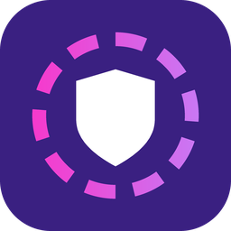

  

<h1 align="center">Safeguard</h1>

<b>A calm heads-up for parents when Discord or Roblox chat needs a look.</b> 
Free · Windows 10/11 · from  IT Consultants LLC

---

## In one breath

Safeguard sits in the corner of your child's Windows screen, **in plain sight**. While Discord or Roblox is open, it reads the chat on the screen. If someone asks your child for their address, asks them to keep secrets, asks for pictures, or wants to meet up, **Safeguard emails you**, along with a calm suggestion for how to talk about it.

It **never** blocks games, deletes messages, or hides from your child.

---

## What you'll see

| | |
|---|---|
| 🛡️ **A shield in the tray** | Always visible. Your child can see it's on, too. |
| 🟢 **Green dot** | Discord or Roblox is open and Safeguard is watching. |
| ⚪ **No dot** | Both apps are closed. Safeguard is resting and using almost no power. |
| 🟠 **Amber dot** | Something needs a look. Open Safeguard to see it. |
| ⬜ **Gray shield** | You turned watching off. |

## What it looks for

Safeguard watches for **behaviours** that child-safety groups warn about. It does not hunt for bad words.

| Warning sign | Example |
|---|---|
| 🏠 Personal information | *"what school do you go to"* |
| 📲 Moving to another app | *"add me on snap"* |
| 🤫 Secrets from parents | *"don't tell your parents"* |
| 🎁 Building trust too fast | *"free robux"*, *"you're so mature for your age"* |
| 📍 Meeting in person | *"we should meet irl"* |
| 📷 Requests for photos | *"send me a pic"* |

When two warning signs show up together, such as **a secret plus a meet-up**, Safeguard marks it **"please look soon."**

## What an alert looks like

> **Subject:** Safeguard notice: something in Roblox about keeping secrets from parents
>
> Safeguard spotted something in Roblox that you may want to look at.
>
> *"dont tell your parents ok"*
>
> **A calm way to bring it up:** Let them know that no one online should ask them to keep secrets from you, and that they will not be in trouble for telling you about it.
>
> Safeguard only sends a notice. It does not block or delete anything. You decide what to do next.

💬 **Every alert comes with a conversation starter.** The goal is a talk, not a punishment. Kids who expect to get in trouble stop telling.

## Your privacy (and your child's)

- 🔒 **Everything stays on this computer.** Chat is read and checked on the device. Nothing goes to a cloud.
- 🗑️ **Everyday chat is never saved.** Only the lines that needed a look go into a locked log, and it deletes itself after 30 days.
- ✉️ **Emails go from your own mailbox to your own mailbox.** Your password is locked to your Windows sign-in.
- 👀 **Nothing is hidden.** There's even a *"What is Safeguard? (for kids)"* button in the tray menu, written for your child.

## Honest limits

- Safeguard can only read what's **on the screen**. If the chat isn't open, it can't see it.
- Roblox chat is read from a picture of the game, so **some lines will be missed** or misread.
- It will sometimes flag harmless chat, and it will sometimes miss real trouble. **It helps you pay attention. It doesn't replace you.**
- Provided **as-is, with no warranty**.

> 🚨 If you think a child is in danger right now, call **911**.
> To report someone asking a child for pictures: **report.cybertip.org** (NCMEC CyberTipline).

---

## Where the project is

| Step | Status |
|---|---|
| Reading Discord and Roblox on a real PC | ✅ Works |
| Parent window and tray shield | ✅ Works |
| Spotting warning signs (with tests) | ✅ Works |
| Locked, flagged-only log | ✅ Works |
| Email setup with a test email | ✅ Built, needs your first real test |
| Only watching *your child's* username | 🔜 Next |
| One-click installer | 🔜 Later |

Safeguard is a Layer One production · © Layer One IT Consultants LLC · Freeware, provided AS-IS
